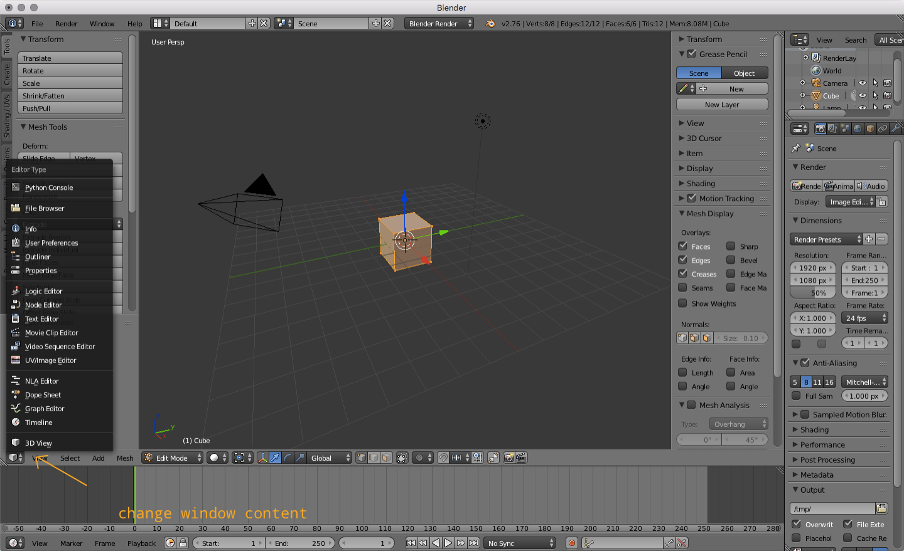
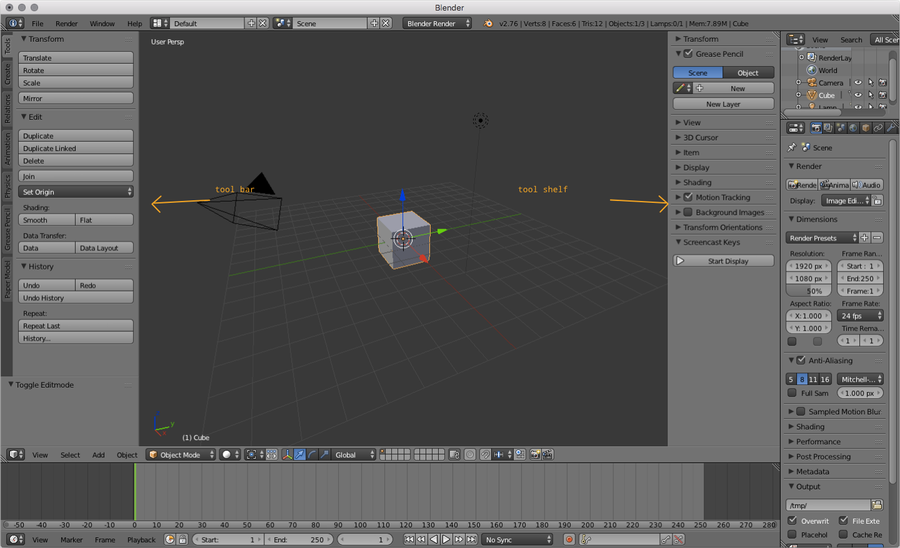
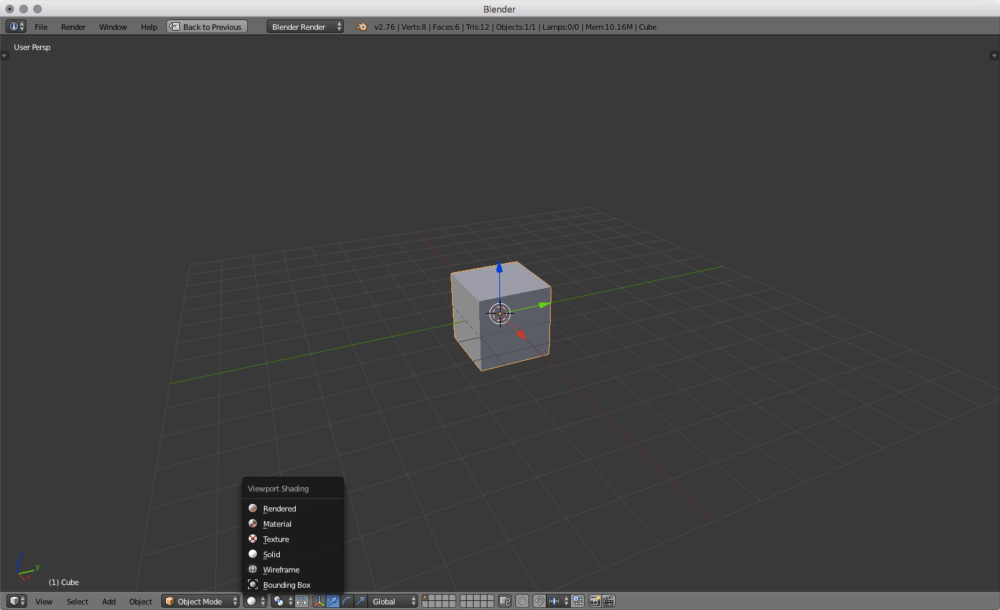
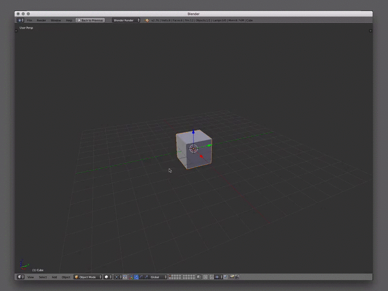
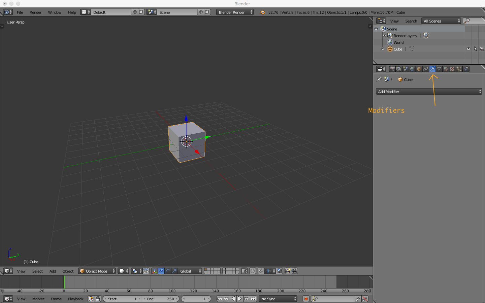
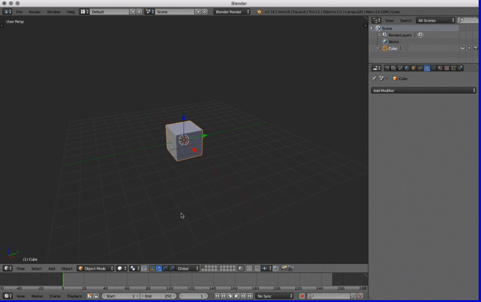
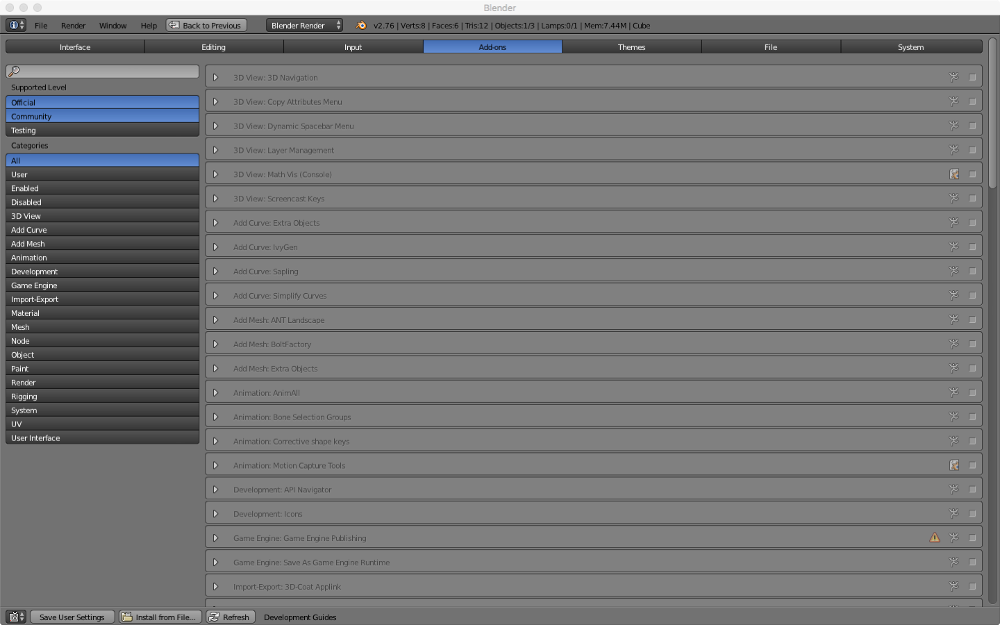
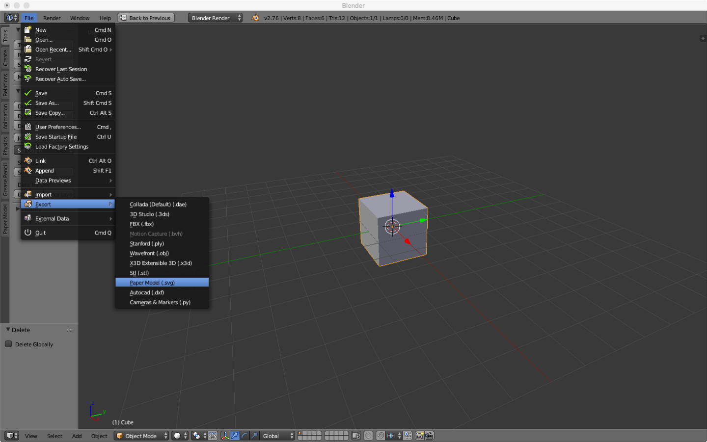
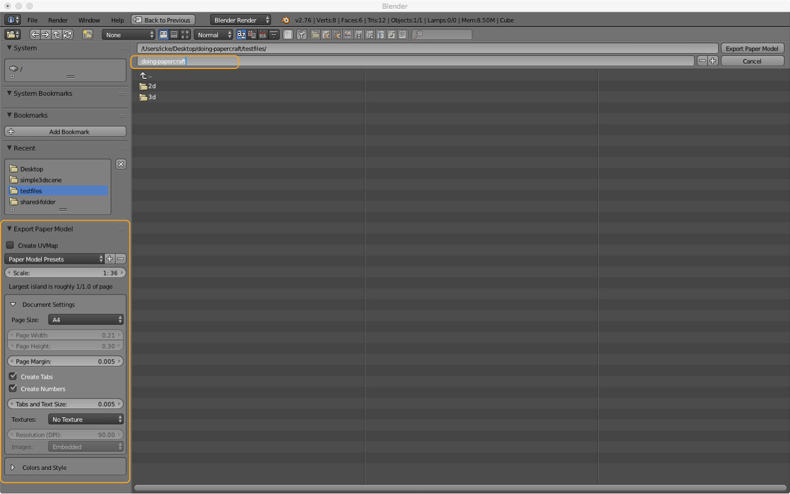

## About Blender 

<!--    -->

>Blender is a professional free and open-source 3D computer graphics software product used for creating animated films, visual effects, art, 3D printed models, interactive 3D applications and video games. Blender's features include 3D modeling, UV unwrapping, texturing, raster graphics editing, rigging and skinning, fluid and smoke simulation, particle simulation, soft body simulation, sculpting, animating, match moving, camera tracking, rendering, video editing and compositing. Alongside the modeling features it also has an integrated game engine.  
>[From Wikipedia, the free encyclopedia](https://en.wikipedia.org/wiki/Blender_\(software\)).  

We use [Blender](https://www.blender.org/) because it is a powerful open source, free of charge 3D application. It has a broad user base and a excellent [reference.](https://www.blender.org/manual/contents.html#) If you are already familiar with Blender, or know other 3D applications like Maya, C4D, Rhino, 3ds Max, or or or, you can skip this part and move on to the [Autodesk 123DMake section](123dmake/) or export your plans directly from within Blender using the [Paper Model Add-on](#paper-model-add-on).

### (UI) Shortcuts  

Blender relies heavily on shortcuts. See an overview of all shortcuts here [waldobronchart.github.io/ShortcutMapper/#Blender](http://waldobronchart.github.io/ShortcutMapper/#Blender). Some shortcuts depend on the position of the mouse e.g. __x__ for deleting only works when the mouse is over the 3D view.  

### (UI) Search Menu  

Another quick way to call actions or open panels is the "Search Menu". It gives you quick access to all of Blenders commands by typing. you can open it just by hitting the __space bar__. This is pretty handy if you know a commands name but don't know where to find it. Read more [here.](https://www.blender.org/manual/interface/extended_controls.html)

##### (UI) Customize  

!!!note
    The interface is highly customizable in Blender. We will only adjust some minor settings to make it more user friendly.  

Go to: __File > User Preferences…__ and select the "Input" tab.  

1. Change the Mouse selection from right click to left click in the settings > input tab
2. "Emulate Numpad" (if you're on a laptop you can use the numbers instead of the numpad)
3. Adjust UI colors in the theme tab (if you like it more fancy)  

!!!hint
    You need to hit __"Save User Settings"__ at the bottom of the window to apply these changes. 

  

You can add or remove windows by right clicking into the "seam" between two windows. This allows you to add new windows or join existing ones. When adding you can toggle a horizontal or vertical split by pressing the middle mouse button This will be indicated by the dashed line that appears on the window you are trying to split. You can do the same by clicking and dragging the striped corner of a window to the left or down. To remove those windows just join them again. (See the animation below.)  

| Mouse                                               | Action                           |
| :---                                                | :---                             |
| Right click window seam                             | split/join windows               |
| Right click window seam select split + middle mouse | toggle horizontal/vertical split |
| click + drag striped corner down/up                 | split horizontally               |
| click + drag striped corner left/right              | split vertically                 |

You can change the content of a window by using the dropdown menu under the icon in the header (which is at the bottom of the 3D view).  

  

##### (UI) View Region 

Within the 3D view you also have a tool bar on the left and the tool shelf on the right. __t__ shows tool bar and __n__ the tool shelf. On the toolbar you have the most common commands for transformation, editing, creation and many more organized as tabs. On the tool shelf you can access commonly used properties for transformations, the view, the 3D cursor and others organized as expandable panels. Both of these regions are kind of quick access palettes for properties and action that are essential for editing.  

  

##### (UI) Viewport Shading  

There are several shading methods available. You can see your model as:  

- Bounding Box
- Wireframe
- Solid
- Texture
- Material
- Rendered

You can switch the shading method on the bottom of the 3D view. For us the only important options are "Solid", "Wireframe" and "Bounding Box". Read more about this [in the docs.](https://www.blender.org/manual/editors/3dview/display/shading.html)

  

### (UI) View Navigation  

The basic navigation in the 3D view is done with the mouse. You can also change the view by using the numpad.  

| Mouse                       | Action                 |
| --------------------------: | ----------             |
| left mouse                  | select                 |
| right mouse                 | set 3D cursor position |
| middle mouse click          | orbit                  |
| middle mouse click + ⇧  | pan                    |
| scroll                      | zoom                   |

!!!note
    The most useful keys on the numpad are (table also has emulated numpad)

| Key Combo (emulated) | View Change                                | Key Combo       |
| ----------:          | :----- ----------------------------------- | :----------     |
| 1                    | Front                                      | Numpad 1        |
| Ctrl + 1             | Back                                       | Numpad Ctrl + 1 |
| 3                    | Right                                      | Numpad 3        |
| Ctrl + 3             | Left                                       | Numpad Ctrl + 3 |
| 7                    | Top                                        | Numpad 7        |
| Ctrl + 7             | Bottom                                     | Numpad Ctrl + 7 |
| 5                    | Toggle orthographic vs perspective mode    | Numpad 5        |
| 0                    | Camera View                                | Numpad 0        |
|                      | **Not so important keys**                  | Numpad          |
| 4                    | Orbit Left                                 | Numpad 4        |
| Ctrl + 4             | Pan Left                                   | Numpad Ctrl + 4 |
| 6                    | Orbit Right                                | Numpad 6        |
| Ctrl + 6             | Pan Right                                  | Numpad Ctrl + 6 |
| 8                    | Orbit Up                                   | Numpad 8        |
| Ctrl + 8             | Pan Up                                     | Numpad Ctrl + 8 |
| 2                    | Oribit Down                                | Numpad 2        |
| Ctrl + 2             | Pan Down                                   | Numpad Ctrl + 2 |
| -                    | Zoom Out                                   | Numpad -        |
|                      | Zoom In (seems not to work)                |                 |

### (UI) Cursor  

The 3D cursor is a pivot point for various features. You can e.g. rotate objects around the cursor (see image below). Newly created objects get created at this position. You can also use the cursor to snap objects to it or the other way around.  

| Key/Action  | Result                                     |
| :---        | :---                                       |
| right click | set 3D cursor position                     |
| ⇧ + c   | reset 3D cursor to the centre of the scene |
| ⇧ + s   | open snap menu (snap to cursor and so on)  |

### (Modeling) Modes  

The __"Object Mode"__ is for working with objects in a whole and editing your scene. You can add objects, cameras lamps and others in this mode. The __"Edit Mode"__ is for editing the vertices, edges or faces of an object. When using [modifiers](#modifiers) you see their effect in object mode, __not in Edit Mode__. You can switch between Object and Edit mode just by hitting __⇥__ when your mouse is ove the 3D viewport. There are more modes available. [Readmore in the docs.](https://www.blender.org/manual/editors/3dview/object/modes.html)

##### (Modeling) Add & Delete

On the tool bar on the left of the 3D view you have various possibilities to add objects.
Use the Create tab an the left to add basic shapes. You can also use the hotkey __⇧ + a__ or use the "Add" menu at the bottom of the 3D view. When you create a new shape you get a new panel at the bottom of the toolbar. it is called the operator panel. There you can set additional settings for the newly created shape e.g. the subdivision of a ICO Sphere or the depth and the radius of a cylinder ad so on. __This is only possible on creation of the shape.__ If the operator panel does not show up just hit __F6__ to show it as a floating panel.  
To delete the selection hit __x__ this applies for Edit- and Object Mode. In Edit Mode you get an additional panel to decide what should be deleted e.g. Vertices, edges, faces and even more options like edge collapse and more. You need to play with it and [read in the manual](https://www.blender.org/manual/modeling/meshes/editing/basics/deleting.html) about it.

| Key/Action   | Result                         |
| :---         | :---                           |
| Toolbar Left | add different type of objects  |
| Add Menu     | add different type of objects  |
| ⇧ + a        | open "Add" floating panel      |
| F6           | open "Operator" floating panel |
| x            | delete selection               |

### (Modeling) Making Selections  

To select objects use the left mouse click (if set to left selection. The default is right selection). You can add or remove objects to or from the selection by holding __⇧__. Selected objects are highlighted in orange (default theme). The first in the order of selected objects is a bit brighter. You can also select everything by hitting __a__. In "Edit Mode" there are some extra options for selecting things. You can switch between vertices, edges and faces selection and you can combine them with the buttons on the bar below the 3D view. 
Ther are also other selection modes. The rectangular (key __r__ ) or circular (key __c__) selection allows to select  by clicking and dragging. This only applies to the visible objects, vertices, edges and faces. You can change this behavior if you want to selection to apply to non visible objects as well. There are even more options for selecting. Like Inverting selections and so on. See [the Blender Manual](https://www.blender.org/manual/modeling/meshes/selecting/introduction.html#selection-mode)  

  

| Action                       | Result                               | Mode             |
| :---                         | :---                                 | :---             |
| Left Mouse                   | select                               | Object/Edit Mode |
| Left Mouse + ⇧               | add/remove                           | Object/Edit Mode |
| a                            | select all                           | Object/Edit Mode |
| ^ + i                        | invert the current selection         | Object/Edit Mode |
| ^ + Tab                      | selection mode switcher              | Edit Mode        |
| b + left mouse click & drag  | select rectangular area              | Edit Mode        |
| c + left mouse click & drag  | paint selection area                 | Edit Mode        |
| c + left mouse + mouse wheel | paint selection increase or decrease | Edit Mode        |

  

##### (Modeling) Duplication

To duplicate the current selection (in edit or object mode) just hit __⇧ + d__. This also sets the newly created objects into grab mode so you can set their new position. All the [Transformation](#transformation) rules apply.  

| Action                       | Result                               | Mode             |
| :---                         | :---                                 | :---             |
| ⇧ + d                        | duplicates the selected object       | Object/Edit Mode |

##### (Modeling) Transformation Using Manipulators

You can transform objects, groups, vertices, edges and faces (i.e. your selection) by using the 3D manipulators. Change between grab, rotate and scale mode on the bottom of the 3D view. You can combine them or shut them off totally. If you click and drag into the circle at the centre of the manipulator you transform on all axis at once.  

  

##### (Modeling) Transformation Using Hotkeys  

Sometimes it is more convenient to use the hotkeys. When using the hotkeys you can easily constrain the manipulation to an axis. Just hit for example __g + x__ to only move the selection on the global x-axis. If you hit __x__ twice you transform on the objects local axis. The second transformation corresponds with the pull down next to the manipulator buttons on the button of the view. Read some more about the manipulators [here](https://www.blender.org/manual/editors/3dview/transform/transform_control/manipulators.html).   

| Key            | manipulation                                                  |
| :---           | :---                                                          |
| r              | rotate                                                        |
| r + x/y/z      | rotate on one axis only (global)                              |
| r + x/y/z × 2  | rotate on one axis only (selected axis)                       |
| g              | transform (grab)                                              |
| g + x/y/z      | transform (grab) on one axis only (global)                    |
| g + x/y/z × 2  | transform (grab) on one axis only (selected axis)             |
| s              | scale                                                         |
| s  + x/y/z     | scale on one axis only (global)                               |
| s  + x/y/z × 2 | scale on one axis only  (selected axis)                       |
| alt + g        | snaps selection to the center of the scene (Object Mode only) |

  

### (Modeling) Mesh Manipulation

Besides just adding primitive shapes on one another you can also edit the mesh directly. To do this
Go to Edit Mode by hitting the __⇥__ key (TAB). As mentioned in the [(Modeling Making Selections)](#modeling-making-selections) section you can select in different ways. Vertices only, faces or edges or combine these options. You can now move the selection around. To manipulate your mesh even further you can copy and paste your selection. (__⌘  + c__ & __⌘ + v__). Additionally you can use several options on the toolbar to edit your mesh. Each option has its own operators.   

##### (Modeling) Extrude  

Extrudes the current selection. [All Transformation](#transformation) and [Selection](#selection) options apply. You can basically differentiate between "extrude region" (hit __e__ or use the button on the toolbar) and "extrude individual". The region extrudes the selection together. The individual extrusion uses each local axis to extrude. See [the manual for further information.](https://www.blender.org/manual/modeling/meshes/editing/duplicating/extrude.html)

  

| Key/Action | Result             |
| :--        | :--                |
| e          | Extrude Region     |
| ⌥ + e      | Extrude Individual |

##### (Modeling) Separate  

You might come to the point where you need to separate an object in multiple ones. There is an easy short cut for that. Go into Edit Mode (hit ⇥) and select the faces or vertices you want in an new object and hit __p__. You will be presented with a dialog that allows you to split by:  

| Key/Action | Result                      |
| :--        | :--                         |
| p          | brings up the separate menu |

| Split Type          | Outcome                                              |
| :---                | :---                                                 |
| __Selected__        | This option separates the selection to a new object. |
| __All Loose Parts__ | Separates the mesh in its unconnected parts.         |
| __By Material__     | Creates separate mesh objects for each material.     |

Read more [here.](https://www.blender.org/manual/editors/3dview/object/editing.html#separate)  

##### (Modeling) Join  

To join selected objects into one single object you can select them all. in __j__. Be aware that they will all be joined into the last selected object. You can see it in the difference in the highlight color. Read more [here.](https://www.blender.org/manual/editors/3dview/object/editing.html#join)

| Key/Action | Result                                                   |
| :--        | :--                                                      |
| ^ + j      | merges all objects into the last selected Active object. |

##### (Modeling) Other Manipulations  

| Key/Action | Result                    | Description                                        |
| :---       | :---                      | :---                                               |
| f          | Fill                      | Fills the selection with vertices, edges and faces |
| ^ + f      | Face manipulation panel   | Various options to edit faces                      |
| i          | inset face                | Works only with faces                              |
| ^ + b      | bevel                     | Works only with faces                              |
| ^ + e      | Edge manipulation panel   | Various options to edit edges                      |
| ^ + v      | Vertex manipulation panel | Various options to edit vertices                   |
| w          | Specials Panel            | Holds various options                              |

To create new geometry on an existing one you can use the several options. Subdivide, Loop Cut and Slide or the Knife to name just a few. Subdivide for example divides the surface a defined number of times and gives some more options, like smoothness and fractal noise. Loop Cut and Slide allows to subdivide a selection as well by setting a position to cut in by dragging the mouse. the Knife does what it says. Allows to cut the mesh.  

!!!hint
    You will see extra information on some tools on the bottom bar of the 3D view. The Knife for example needs to be confirmed by hitting ↩ (RETURN). Explore the tools by playing with them.  

### Using Modifiers  

Some modifications can be tedious when done by hand. Fortunately lots of operations have already been pre defined as modifiers. You can access them on the "Properties" window under the little wrench. All modifiers first only affect the selected object. If you want to generate real mesh from them you need to apply them. Also be aware that modifiers work in stack. The order of them define their outcome. You can move them in the stack order by using the up and down arrows on each modifier. We will take a look at some of them that might be useful for our purpose. When you export your form for exchange with the forthcoming applications you don't need to apply these modifiers. An export to Wavefront obj will add all these vertices to the mesh. Read more about modifiers [here.](https://www.blender.org/manual/modeling/modifiers/index.html)  

| Type     | Name                                                 | Short Description                                               |
| :---     | :---                                                 | :---                                                            |
| Generate | [Subdivision Surface Modifier](#subdivision-surface) | Subdivide surface of selected object                            |
| Generate | [Boolean Modifier](#boolean)                         | Intersect, unify or differentiate objects from one another      |
| Deform   | [Simple Deform Modifier](#simple-deform)             | Deform objects by Twisting, bending,tabering or stretching them |
| Generate | [Array Modifier](#array)                             | Create multiple copies of an object                             |
| Generate | [Bevel Modifier](#bevel)                             |                                                                 |   

  

##### (Modifiers) Subdivision Surface

This modifier divides each surface by the number set in the view/render section of it. The difference between view and render should be clear. View is what we see in the 3D view. Render is what will be used in the final render. For our purpose the only thing we need to be concerned about is the view setting. This is what will be exported into our exchange formats. You can also switch between a "Simple" and "Catmull-Clark". To see the result before applying you need to switch the shading type to Wireframe. You can read more about this modifier [here.](https://www.blender.org/manual/modeling/modifiers/generate/subsurf.html)  

> __"Catmull-Clark"__
> The default option, subdivides and smooths the surfaces. According to [its Wikipedia page](https://en.wikipedia.org/wiki/Catmull%E2%80%93Clark_subdivision_surface), the “arbitrary-looking formula was chosen by Catmull and Clark based on the aesthetic appearance of the resulting surfaces rather than on a mathematical derivation.  

  

##### (Modifiers) Boolean  

The "Boolean Modifier" can be used to create intersection between two objects. When you first apply it you wont see any change. You need to select another object in your scene to be used as the mesh object for the operation. Then you have 3 different methods to apply the modifier. Read more [here.](https://www.blender.org/manual/modeling/modifiers/generate/booleans.html) 

| Methods    | Result                                                |
| :---       | :---                                                  |
| Intersect  | The target mesh is subtracted from the modified mesh. |
| Union      | The target mesh is added to the modified mesh.        |
| Difference | The modified mesh is subtracted from the target mesh. |

  

##### (Modifiers) Simple Deform  

> The Simple Deform modifier allows easy application of a simple deformation to an object (meshes, lattices, curves, surfaces and texts are supported).  
> [Simple Deform Modifier](https://www.blender.org/manual/modeling/modifiers/deform/simple_deform.html#simple-deform-modifier)  

| Mode    | Description                                                                                                                           |
| :---    | :---                                                                                                                                  |
| Twist   | Rotates around the Z axis.                                                                                                            |
| Bend    | Bends the mesh over the Z axis.                                                                                                       |
| Taper   | Linearly scales along Z axis.                                                                                                         |
| Stretch | Stretches the object along the Z axis (negative Factor leads to squash), preserving volume by scaling inversely on the X and Y axes.. |

  

##### (Modifiers) Array  

The "Array Modifier" can be used to duplicate elements. You can offset the copies on the 3 axis relative or constantly. You can use an objects transformation to define the offset as well. There are some more options for this modifier. It can be pretty powerful to create multiple copies of an object. Read more [here.](https://www.blender.org/manual/modeling/modifiers/generate/array.html)  

  

##### (Modifiers) Subdivide and Displace  

To show you what can be done by combining several modifiers the following animation shows how to use the [Subdivision Surface](subdivision-surface) and [Displace](https://www.blender.org/manual/modeling/modifiers/deform/displace.html) modifiers together. The subdivision is done to create more vertices and the displacement to generate some offset on them. The displace modifier uses textures to offset the vertices. You could also use an image or a ramp to displace the vertices. Be creative. This is already rather complex for the starters. Use it as inspiration. There are many more modifiers. To much to explore them all here. Play with some/all of them.  

  

### Add-ons  

Additionally to the many build in features of Blender there is a whole ecosystem of [Add-ons](https://www.blender.org/manual/advanced/scripting/python/add_ons.html). There are several Add-ons that are directly distributed with Blender but bot enabled by default. You can browse them in the user preferences an enable those that you like to use. You can also install Add-ons from file. These are Python scripts that are written by members of the community. For our project there are two Add-ons we need to download and install.  

  

1. [Export: Paper Model (.svg) | Export printable net for paper modeling](https://git.blender.org/gitweb/gitweb.cgi/blender-addons-contrib.git/blob_plain/refs/heads/master:/io_export_paper_model.py)  
2. [Autodesk DXF (.dxf) | Export geometry to .DXF file format.](http://wiki.blender.org/index.php/Extensions:2.6/Py/Scripts/Import-Export/DXF_Exporter)  

##### (Add-on) Paper Model 
Both are pretty self-explanatory. The Paper Model Add-on adds under File > Export > Paper Model (.svg) the possibility to export a unfolded vector graphic of the selected object. In the export panel ae on the lower left side some export options for the graphic. You can specify the page size, add margins, create tabs for gluing your model and some more options but the default options are pretty good. If the export fails try to scale your model down or increase the size. We will adjust the plans size later on in a vector editor. Read some more about this Add-on [here.](http://wiki.blender.org/index.php/Extensions:2.6/Py/Scripts/Import-Export/Paper_Model)

  
  

##### (Add-on) DXF export

!!!hint
    The DXF export Add-on might be useful when working with "dxf2papercraft".

### Export  

To export our data we can use different options. For one we can use the Paper Model Add-on]. Then we have a vector graphic we just have to clean up and convert to [DXF](https://en.wikipedia.org/wiki/AutoCAD_DXF) to use it for laser cutting. If this is your chosen workflow, move on to [Creating Clean Plans](#creating-clean-data). If you want to use 123DMake or Paperkura you need to use an interchange format like [STL](https://en.wikipedia.org/wiki/STL_\(file_format\)) or [OBJ](https://en.wikipedia.org/wiki/Wavefront_.obj_file). You don't need to specify a final scaling. 123DMake and Paperkura both allow to edit the scaling of the Model and the material/paper size.  

##### (Export) STL STereoLithography

If you use STL you need to use the ascii format and apply all modifiers when used. It would be better that you don't apply the modifiers from within the Add-on. As already mentioned the modifiers depend on their stack, so applying them by hand gives you a better control over the outcome.  

#### (Export) OBJ Wavefront  

You can also use the [Wavefront OBJ](https://en.wikipedia.org/wiki/Wavefront_.obj_file) format. It has some more options for the export then the STL but creates a equivalent result. You also should apply the modifiers first as mentioned for the [STL](#stl-stereolithography) export.  

