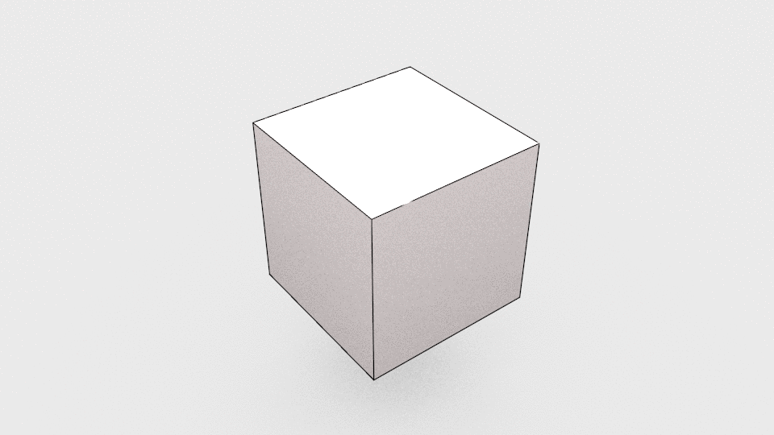

Doing Papercraft
================

  

## Introduction  

This document is a write-down for a workshop @ the University of Applied Sciences Potsdam (Germany) as part of the seminar ["Datenobjekte"](https://incom.org/workspace/6569) (data objects) by [Professor Boris Müller](https://incom.org/profil/99) (a.k.a [@borism](https://twitter.com/borism) on Twitter). We will explore the minimal basics of the 3D application Blender to create primitive shapes which will then be unfolded for laser cutting. _This is still work in progress, there might be_ 🐛_,_ 🐉 _and_ 👾_._  

## Prerequisites  

- a computer
- a 3 button mouse
- Blender (or another 3D application if you already know how to model in 3D)
- 123DMake 
- Vector Editor (Illustrator, Inkscape, Affinity Designer)  
- Processing  

Some of these are optional. Depending on which workflow you are going to use.  
